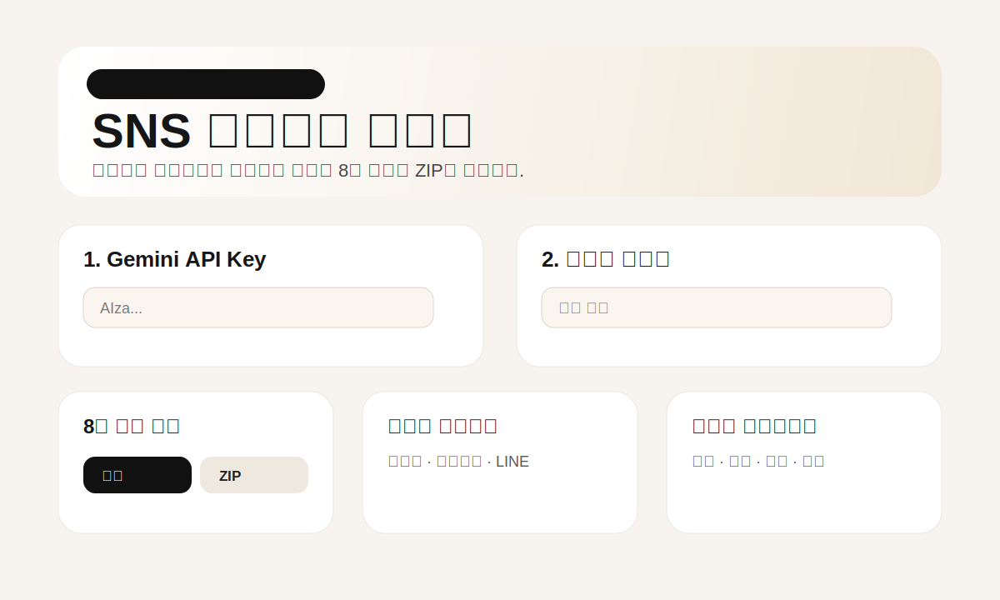

# SNS Emoticon Maker



**SNS Emoticon Maker**는 사용자가 직접 발급한 Gemini API Key를 사용해서 이미지를 SNS용 이모티콘/스티커 스타일로 변환하는 무료 웹앱입니다.

## 목표

- 운영자는 AI 사용료를 부담하지 않는 무료 배포형 프로젝트
- 사용자는 자신의 Gemini API Key를 입력해서 사용
- API Key는 브라우저에만 저장하고, 프로젝트 DB에는 저장하지 않음
- 카톡, 텔레그램, 왓츠앱, 디스코드, LINE, 인스타그램용 내보내기 방향 지원
- 향후 Chrome Extension으로 확장 가능

## 주요 기능

- 이미지 업로드
- Gemini API Key 입력 및 브라우저 저장
- 30개 스타일 라이브러리
- 스타일별 대표 이모티콘 미리보기 UI
- 플랫폼별 규격 프리셋
- Vercel 배포 친화 구조
- Chrome Extension 초안 포함

## 프로젝트 구조

```text
sns_emoticon_maker/
├── app/
│   ├── api/generate/route.ts
│   ├── globals.css
│   ├── layout.tsx
│   └── page.tsx
├── components/
├── docs/
├── extension/
├── lib/
├── public/docs/
├── .env.example
├── package.json
└── vercel.json
```

## 로컬 실행

```bash
npm install
npm run dev
```

브라우저에서 아래 주소로 접속합니다.

```text
http://localhost:3000
```

## Vercel 배포

1. GitHub에 이 저장소를 올립니다.
2. Vercel에서 **New Project**를 선택합니다.
3. `REDPAPA1000/sns_emoticon_maker` 저장소를 연결합니다.
4. Framework Preset은 **Next.js**로 둡니다.
5. Deploy를 누릅니다.

## 무료 운영 방식

이 프로젝트는 BYOK, 즉 **Bring Your Own Key** 방식입니다.

```text
사용자
→ 자신의 Gemini API Key 입력
→ SNS Emoticon Maker에서 이미지/스타일 선택
→ Gemini API 호출
→ 결과 다운로드
```

운영자가 공용 API Key를 서버에 넣지 않아도 되므로, 사용자가 늘어도 AI 사용료가 운영자에게 집중되지 않습니다.

## 다음 개발 TODO

- 실제 Gemini 이미지 생성 응답 안정화
- 투명 PNG 후처리
- 플랫폼별 자동 리사이즈
- ZIP 다운로드
- GIF/애니메이션 스티커
- Chrome Extension에서 이미지 우클릭 → 스티커 만들기
